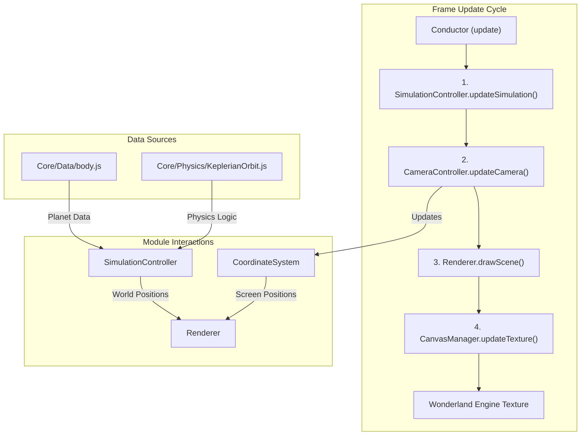

# How the Orbital VR Simulation Works

This document provides a high-level overview of the core architecture for the Orbital VR simulation. It explains how the different modules collaborate to create the final visualization, focusing on the data flow from physics calculation to rendering.

## Core Architecture

The simulation is orchestrated by a main component (`Drawer` in `Conductor.js`) which manages several specialized controllers. The general flow on each frame is:

1.  **`Conductor` (The Orchestrator)**: The main `update` loop starts here.
2.  **`SimulationController` (The Physicist)**: It advances the simulation time and calculates the new positions of all celestial bodies based on Keplerian mechanics.
3.  **`CameraController` (The Cinematographer)**: It updates the view based on the current camera mode (e.g., solar system view, planet focus) and the position of the target planet.
4.  **`Renderer` (The Artist)**: It takes the calculated positions and camera settings to draw everything (planets, orbits, UI) onto a 2D canvas.
5.  **`CanvasManager` (The Projector)**: It pushes the final drawing from the canvas to a Wonderland Engine texture, making it visible in the VR world.

---

## Component Breakdown

### 1. The Conductor (`Core/Display/Conductor.js`)

The `Drawer` component is the central hub of the simulation.

-   **Role**: It initializes all other controller modules and orchestrates the main update loop.
-   **Initialization (`start`)**: It creates instances of `CanvasManager`, `SimulationController`, `CameraController`, and `Renderer`, linking them together.
-   **Frame Update (`update`)**:
    -   It calls `simulationController.updateSimulation()` to advance the physics.
    -   It calls `cameraController.updateCamera()` to position the viewpoint.
    -   It calls its own `_render()` method, which in turn uses the `Renderer` to draw the scene.

### 2. The Data and Physics Engine

#### `Core/Data/body.js`
-   **Role**: This file is the **database** for the entire solar system.
-   **Contents**: It contains a static `planetData` object with all the physical properties (mass, radius) and Keplerian orbital elements (semi-major axis, eccentricity, etc.) for the Sun, planets, and moons.
-   **To Add a Planet**: A new developer would add a new entry to the `planetData` object here.

#### `Core/Physics/KeplerianOrbit.js`
-   **Role**: This file contains the classes that perform the orbital mechanics calculations.
-   **`Orbit` class**: Represents the mathematical definition of an orbit. Its `getPositionAtTime(t)` method is the core of the physics, solving Kepler's Equation to find a body's position along its elliptical path at a given time `t`.
-   **`CelestialBody` class**: Represents a planet, moon, or star. It holds its physical data and an `Orbit` object. Its `updatePosition(t)` method calls the underlying `Orbit` object to update its own `position` property.
-   **`SolarSystem` factory**: Its `createAllBodies()` method reads the data from `body.js` and uses it to construct a list of `CelestialBody` objects for the simulation to use.

### 3. The Simulation Controller (`Core/Display/Rendering/SimulationController.js`)

-   **Role**: Manages the simulation's state and time.
-   **Initialization (`initState`)**: It calls `SolarSystem.createAllBodies()` to create all the planets and moons.
-   **Frame Update (`updateSimulation`)**:
    -   It advances its internal `simulationTime` by `deltaTime * timeMultiplier`.
    -   It then calls `updateKeplerianOrbits()`, which loops through every `CelestialBody` and calls its `updatePosition()` method with the new `simulationTime`.
    -   It also manages the history of positions for each body, which is used to draw the orbital trails.

### 4. The Camera and Coordinate System

#### `Core/Display/CoordinateSystem.js`
-   **Role**: This is a crucial utility class that translates between different coordinate systems.
-   **Function**: Its primary job is to convert **world coordinates** (positions in meters, relative to the Sun) into **screen coordinates** (pixel positions on the 2D canvas).
-   **Features**: It manages the concept of `metersPerPixel` (zoom level) and the `cameraCenter` (panning). It defines different scales and multipliers for various camera modes (`SOLAR_SYSTEM`, `PLANET`) to ensure planets are visible at different zoom levels.

#### `Core/Display/Rendering/CameraController.js`
-   **Role**: Manages the `UniversalCoordinateSystem` based on user settings.
-   **Function**: It reads the `cameraMode` and `targetPlanet` from the main `Drawer` component. It then instructs the `UniversalCoordinateSystem` to change its mode, zoom level, and center position accordingly. For example, in `PLANET` mode, it tells the coordinate system to center on the target planet's position.

### 5. The Rendering Pipeline

#### `Core/Display/Rendering/Renderer.js`
-   **Role**: The "artist" that performs all drawing operations on the canvas. It knows nothing about physics; it only knows how to draw shapes and text at given pixel coordinates.
-   **Drawing Process (`_render` in `Conductor.js`)**:
    1.  `clear()`: Wipes the canvas clean.
    2.  `drawTrail()`: For each body, it gets the position history from the `CelestialBody` object, converts each point to screen coordinates using the `coordSystem`, and draws lines connecting them.
    3.  `drawPlanet()`: For each body, it converts its current world position to screen coordinates and draws a circle or sprite at that location. It calculates the visible radius of the planet based on the camera mode and zoom level.
    4.  `drawUI()`: Draws text information like the simulation speed and selected planet.

#### `Core/Display/Rendering/CanvasManager.js`
-   **Role**: Manages the interface between the 2D canvas and the 3D Wonderland Engine world.
-   **Initialization**: It creates the offscreen `<canvas>` element and a WLE `texture` from it. It assigns this texture to the material provided by the `Drawer` component.
-   **Frame Update (`updateTexture`)**: After the `Renderer` has finished drawing to the canvas for the frame, this method is called. It signals to Wonderland Engine that the texture's content has changed and needs to be re-uploaded to the GPU.

### 6. Educational Scripts (`Interaction/EduScript/DistGraph.js`)

-   **Role**: These are self-contained components that provide specific educational visualizations.
-   **Example (`DistanceGraph`)**:
    -   It runs its own `update` loop.
    -   It gets a reference to the `simulationController` from the main `Drawer` component.
    -   It reads the positions of the Sun and the target planet directly from the simulation bodies.
    -   It calculates the distance, stores it in a history array, and draws a graph onto its own separate canvas, which is then rendered to its own material in the scene.
    -   This demonstrates a decoupled pattern for adding new, independent visual elements.

---

### 7. Handling Barycenters and Secondary Bodies

The simulation handles complex systems like the Earth-Moon duo by creating a "parent-child" relationship in the data. Instead of every object orbiting the Sun, some objects orbit other moving points.

#### Secondary Bodies (e.g., The Moon)

A moon is not treated differently from a planet in terms of its class (`CelestialBody`). The difference lies in its data definition within `Core/Data/body.js`.

-   **Data Definition**: A secondary body like the Moon has a special property in its data, likely called `orbiting`, which is set to the name of its parent (e.g., for the Moon, `orbiting: 'Earth'`).
-   **Position Calculation**: When the `SimulationController` updates positions:
    1.  It first calculates the parent's position (e.g., Earth) in the world.
    2.  Then, it calculates the moon's position *relative to its parent*.
    3.  The final world position of the moon is the parent's world position plus the moon's position relative to the parent.

#### Barycenters (e.g., The Earth-Moon System)

To accurately model the "wobble" of the Earth and Moon, the simulation uses a **barycenter**, which is the center of mass between them.

-   **A Fictional Point**: A special `CelestialBody` is created in `body.js` called `"Earth-Moon Barycenter"`. This is an invisible point in space.
-   **Hierarchy**:
    1.  The **"Earth-Moon Barycenter"** is set to orbit the **Sun**. Its orbit is calculated using the combined mass of the Earth and Moon.
    2.  The **Earth** is then set to orbit the **"Earth-Moon Barycenter"**.
    3.  The **Moon** is also set to orbit the **"Earth-Moon Barycenter"**.
-   **Rendering**: The `Renderer` has specific logic (`if (body.isBarycenter)`) to draw a special marker for this invisible point when in the focused planet view (`cameraMode === 3`), making the concept easier to visualize.